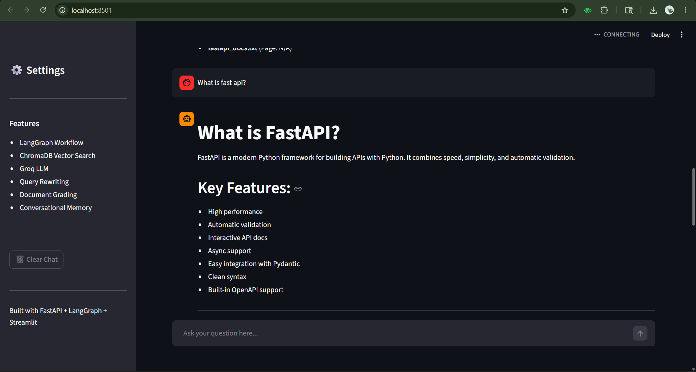
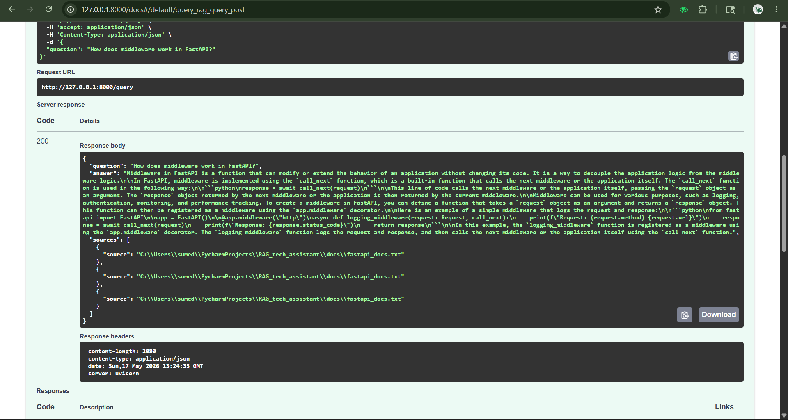

# 📚 RAG Technical Documentation Assistant

A Retrieval-Augmented Generation (RAG) based AI assistant for answering questions from technical documentation using LangGraph, FastAPI, ChromaDB, HuggingFace Embeddings, and Groq LLMs.

---

# 🚀 Project Overview

This project is a self-corrective RAG pipeline designed to answer technical questions from a custom documentation corpus.

The system retrieves relevant document chunks from a vector database, grades document relevance using an LLM, and generates grounded answers using only the retrieved context.

The application includes:

* FastAPI backend
* LangGraph workflow orchestration
* ChromaDB vector database
* HuggingFace embeddings
* Groq LLM integration
* Streamlit chat UI
* Conversational memory
* Document relevance grading
* Query rewriting
* Multi-document ingestion

---

# 🖥️ UI Preview

## Streamlit Chat Interface



---

## FastAPI Swagger Documentation



---

## 🧠 Architecture

```
User Query
    │
    ▼
Streamlit Frontend  (localhost:8501)
    │
    ▼
FastAPI Backend     (localhost:8000)
    │
    ▼
LangGraph Workflow
    │
    ├──► Query Analysis        ← Rewrites & classifies query
    │         │
    ▼         ▼
    Retrieval (ChromaDB)       ← Semantic similarity search
          │
          ▼
    Document Grading           ← LLM grades each chunk
          │
    ┌─────┴──────┐
    │            │
    ▼            ▼
Relevant     Not Relevant
    │            │
    │       Retry / Rewrite   ← Self-corrective loop (max 3)
    │            │
    └─────┬──────┘
          ▼
    Answer Generation          ← Grounded, cited response
          │
          ▼
    Final Response + Sources
```

---

# ⚙️ Tech Stack

| Component              | Technology             |
| ---------------------- | ---------------------- |
| Backend API            | FastAPI                |
| Workflow Orchestration | LangGraph              |
| LLM Framework          | LangChain              |
| Vector Database        | ChromaDB               |
| Embeddings             | HuggingFace Embeddings |
| LLM Provider           | Groq                   |
| Model                  | llama-3.1-8b-instant   |
| Frontend               | Streamlit              |
| Language               | Python                 |

---

# 📂 Project Structure

```text
RAG_tech_assistant/
│
├── app/
│   ├── main.py
│   ├── config.py
│   ├── frontend.py
│   ├── ingest.py
│   ├── langgraph_workflow.py
│   ├── retrieval.py
│   ├── query_analysis.py
│   ├── document_grader.py
│   └── generation.py
│
├── docs/
│
├── chroma_db/
│
├── requirements.txt
├── .env
└── README.md
```

---

# 🔄 LangGraph Workflow

## 1. Query Analysis

The user question is rewritten into a retrieval-optimized query.

Responsibilities:

* Query rewriting
* Query expansion
* Conversational context handling
* Query type classification

Example:

```text
User Question:
Give me an example.

Rewritten Query:
Give me an example of FastAPI dependency injection using Depends().
```

---

## 2. Retrieval

The rewritten query is used to retrieve semantically relevant document chunks from ChromaDB.

Features:

* Semantic similarity search
* Top-k retrieval
* Metadata preservation
* Similarity score tracking

Embedding Model:

```text
sentence-transformers/all-MiniLM-L6-v2
```

---

## 3. Document Grading

Each retrieved document is graded using the LLM.

Purpose:

* Filter irrelevant chunks
* Reduce hallucinations
* Improve grounding quality

Routing Logic:

* Relevant documents → Generation
* No relevant documents → Retry retrieval
* Retry limit reached → Stop

---

## 4. Answer Generation

The final response is generated strictly from the retrieved context.

Features:

* Grounded responses
* Markdown formatting
* Source citations
* Technical explanations
* Hallucination reduction

---

# 💬 Conversational Memory

The application supports multi-turn conversations using session-based chat history.

Example:

```text
User: What is dependency injection in FastAPI?
Assistant: ...

User: Give me an example.
Assistant: ...
```

Conversation history is used during query rewriting to generate context-aware retrieval queries.

---

# 📥 Document Ingestion Pipeline

The ingestion pipeline:

1. Loads technical documents
2. Splits them into chunks
3. Generates embeddings
4. Stores embeddings in ChromaDB

Supported Formats:

* .txt
* .md

Chunking Strategy:

```python
chunk_size = 500
chunk_overlap = 100
```

Reasoning:

* Preserves semantic context
* Prevents context fragmentation
* Improves retrieval quality
* Maintains continuity across chunks

---

# 🌐 API Endpoints

## Root Endpoint

```http
GET /
```

Returns API status.

---

## Query Endpoint

```http
POST /query
```

### Request

```json
{
  "session_id": "user123",
  "question": "What is dependency injection in FastAPI?"
}
```

### Response

```json
{
  "question": "What is dependency injection in FastAPI?",
  "answer": "...",
  "sources": [...]
}
```

---

## Ingest Documents

```http
POST /ingest
```

Supports multi-document upload.

---

## List Documents

```http
GET /documents
```

Returns indexed documents.

---

## Feedback Endpoint

```http
POST /feedback
```

Collects user feedback.

---

# 🖥️ Streamlit Frontend

The project includes a conversational Streamlit frontend.

Features:

* Chat interface
* Conversational memory
* Markdown rendering
* Source display
* Sidebar controls
* Session handling

---

# 🔒 Hallucination Reduction Techniques

The system reduces hallucinations using:

* Context-only prompting
* Document grading
* Retrieval filtering
* Retry routing
* Grounded generation
* Explicit anti-hallucination prompts

---

# 🛠️ Setup Instructions

## 1. Clone Repository

```bash
git clone <repository_url>
cd RAG_tech_assistant
```

---

## 2. Create Virtual Environment

```bash
python -m venv venv
```

### Windows

```bash
venv\Scripts\activate
```

### Linux / Mac

```bash
source venv/bin/activate
```

---

## 3. Install Dependencies

```bash
pip install -r requirements.txt
```

---

## 4. Configure Environment Variables

Create a `.env` file:

```env
GROQ_API_KEY=your_api_key_here
```

---

## 5. Add Documents

Place documentation files inside:

```text
docs/
```

---

## 6. Run Ingestion Pipeline

```bash
python -m app.ingest
```

---

## 7. Run FastAPI Backend

```bash
uvicorn app.main:api --reload
```

Backend URL:

```text
http://localhost:8000
```

Swagger Docs:

```text
http://localhost:8000/docs
```

---

## 8. Run Streamlit Frontend

```bash
streamlit run app/frontend.py
```

Frontend URL:

```text
http://localhost:8501
```

---

# 🧪 Example Questions

```text
What is dependency injection in FastAPI?
```

```text
How do I create a POST endpoint in FastAPI?
```

```text
What is APIRouter?
```

```text
Give me an example.
```

```text
How does FastAPI use Pydantic?
```

---

# 📈 Future Improvements

Planned improvements:

* Streaming responses
* Hybrid retrieval (BM25 + semantic search)
* Hallucination checker node
* PDF ingestion
* LangSmith tracing
* Docker deployment
* Redis memory storage
* Authentication
* Evaluation metrics
* Web search fallback

---

# 🎯 Design Decisions

## Why LangGraph?

LangGraph provides:

* Stateful workflows
* Conditional routing
* Retry logic
* Self-corrective RAG architecture
* Modular orchestration

---

## Why ChromaDB?

Chosen because:

* Lightweight
* Local vector database
* Easy integration with LangChain
* Great for prototyping
* Fast semantic retrieval

---

## Why Groq?

Chosen because:

* Extremely fast inference
* Free tier availability
* Low latency responses
* Easy API integration

---

## Why RecursiveCharacterTextSplitter?

Chosen because:

* Preserves semantic meaning
* Maintains paragraph structure
* Better chunk boundaries
* Improves retrieval quality

---

# 📌 Key Features

✅ LangGraph workflow orchestration

✅ Conversational RAG

✅ Query rewriting

✅ Document grading

✅ Retry routing

✅ ChromaDB retrieval

✅ Streamlit chat UI

✅ Multi-document ingestion

✅ Source citations

✅ Grounded generation

---
